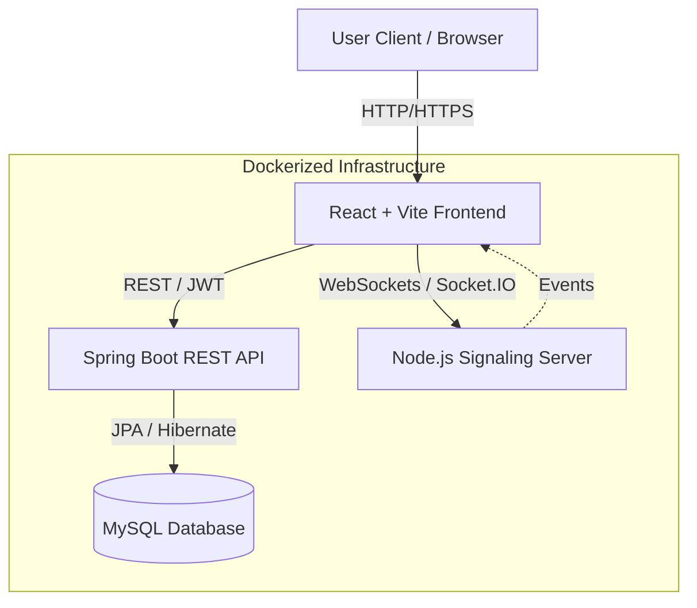

# Interactive-Q: Real-Time Collaboration Platform

> **A full-stack collaboration suite featuring Real-time Chat, Live Polls, Collaborative Whiteboard, and Group Video Calling.**

<!-- 
    IMPORTANT: To make this video play directly on GitHub, you CANNOT use a local path or Google Drive link.
    1. Go to "Issues" -> "New Issue" on GitHub.
    2. Drag & drop 'real_time_project_2.mp4' into the text box.
    3. Copy the 'https://github.com/user-attachments/assets/...' link it generates.
    4. Replace the 'src' below with that link.
-->
<video src="real_time_project_2.mp4" controls width="100%"></video>
<br/>
<!-- Fallback Link if the video doesn't load -->
[**Alternative: Watch on Google Drive**](https://drive.google.com/file/d/1V3NYnuvl0LJZtyDbroDyQWQVfUf5TOlG/view?usp=sharing)

Iteractive-Q is a unified platform designed to enable seamless group interaction. It combines robust enterprise-grade backend services with a dynamic, reactive frontend to deliver low-latency communication and collaboration tools.

---

## 🏗️ Architecture

The system follows a **Micro-Service Hybrid Architecture**, leveraging the strengths of different runtime environments for specific tasks:



### Core Components
1.  **Spring Boot Backend (Business Logic)**:
    -   Handles User Authentication (JWT), Room Management, Message Persistence, and Poll Data.
    -   Serves as the "Source of Truth" for all persistent data.
2.  **Node.js Backend (Real-Time signaling)**:
    -   High-performance event loop for transient, high-frequency events.
    -   Manages **Socket.IO** rooms for Chat, Whiteboard updates, and **WebRTC Signaling** (Video Calls).
3.  **Frontend (SPA)**:
    -   Modern React application bundled with Vite.
    -   Interacts cleanly with both backends to provide a unified user experience.

---

## 🚀 Key Features

### 1. 💬 Real-Time Chat & Polling
-   **Instant Messaging**: Zero-delay message delivery via Socket.IO.
-   **Live Polls**: Create polls, vote in real-time, and see results update instantly without refreshing.
-   **Rich Interactions**: Like messages, tag users, and manage room membership.

### 2. 🎨 Collaborative Whiteboard
-   **Infinite Canvas**: Draw, sketch, and brainstorm together.
-   **Live Sync**: Strokes are broadcasted to all room members in milliseconds.
-   **Tools**: Pen, text, shapes, and eraser support using `perfect-freehand` and `roughjs`.

### 3. 📹 Group Video Call (P2P)
-   **Mesh Topology**: Decentralized peer-to-peer video calling for high privacy and low latency.
-   **WebRTC**: Uses raw `RTCPeerConnection` API for direct browser-to-browser media streams.
-   **Integration**: Seamlessly built into the Room interface—just click the "Video Call" tab to join.

---

## 🛠️ Technology Stack

### Backend (Java)
-   **Framework**: Spring Boot 3.1.5 (Jakarta EE)
-   **Language**: Java 17
-   **Database ORM**: Spring Data JPA (Hibernate)
-   **Security**: Spring Security + JJWT (JSON Web Tokens 0.12.6)
-   **Utilities**: ModelMapper, Lombok

### Backend (Node.js)
-   **Runtime**: Node.js 18+
-   **Framework**: Express.js
-   **Real-Time Engine**: Socket.IO (v4)
-   **Role**: Handles transient events (Typing indicators, WebRTC offers/answers, Whiteboard data).

### Frontend
-   **Framework**: React 18
-   **Build Tool**: Vite 6
-   **Styling**: TailwindCSS (Utility-first styling)
-   **Real-Time Client**: `socket.io-client`
-   **Graphics/Canvas**: `roughjs`, `perfect-freehand`
-   **Icons**: `react-icons`

### DevOps & Infrastructure
-   **Containerization**: Docker & Multi-stage Dockerfiles
-   **Orchestration**: Docker Compose
-   **Database**: MySQL 8.0

---

## 🏃‍♂️ Getting Started

### Prerequisites
-   **Docker Desktop** installed and running.

### Quick Start (Recommended)
Run the entire stack with a single command:

```bash
docker-compose up -d --build
```

**Access Points:**
-   **Frontend**: [http://localhost:5173](http://localhost:5173)
-   **Java API**: [http://localhost:8081](http://localhost:8081)
-   **Socket Server**: [http://localhost:3000](http://localhost:3000)
-   **Database**: Port `3306`

### Manual Setup (Development)

#### 1. Database
Ensure MySQL is running and create a schema named `test_temp`.

#### 2. Java Backend
```bash
cd Backend/main
mvn spring-boot:run
```

#### 3. Node Backend
```bash
cd Backend/NodeJsBackend
npm install
node server.js
```

#### 4. Frontend
```bash
cd Frontend/frontend
npm install
npm run dev
```

---

## 🔒 Security

-   **JWT Authentication**: Stateless authentication mechanism. Tokens are issued by the Java backend and required for all API calls.
-   **CORS Configuration**: Strict Cross-Origin Resource Sharing policies configured on both backends to allow only valid frontend origins.
-   **Room Authorization**: Server-side checks ensure only joined members can view messages or participate in calls.

---

## 🤝 Contribution

1.  **Fork** the repository.
2.  **Clone** your fork.
3.  Create a **feature branch**: `git checkout -b feature/amazing-feature`.
4.  Commit your changes.
5.  Push to branch and submit a **Pull Request**.

---

*Documentation generated by Antigravity AI.*
